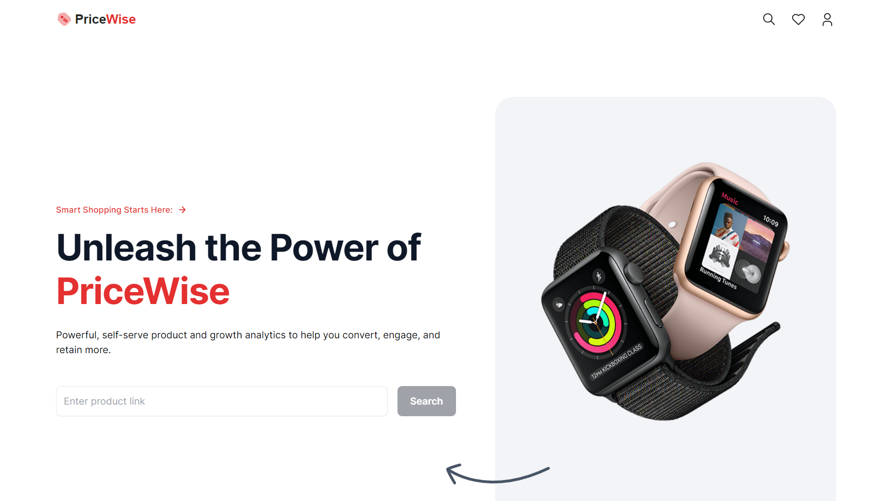

<div align="center">
    <a href="https://pricewise-fv.vercel.app" target="_blank">
      
    </a>
  <h3 align="center">Ecommerce Price Tracking</h3>
</div>

##  <br /> 📋 <a name="table">Table of Contents</a>

- ✨ [Introduction](#introduction)
- ⚙️ [Tech Stack](#tech-stack)
- 📝 [Features](#features)
- 🚀 [Quick Start](#quick-start)

##  <br /> <a name="introduction">✨ Introduction</a>

**[EN]** Developed using Next.js and Bright Data's webunlocker, this e-commerce product scraping site is designed to assist users in making informed decisions. It notifies users when a product drops in price and helps competitors by alerting them when the product is out of stock, all managed through cron jobs.

**[FR]** Développé avec Next.js et le webunlocker de Bright Data, ce site de scraping de produits e-commerce est conçu pour aider les utilisateurs à prendre des décisions éclairées. Il informe les utilisateurs lorsque le prix d'un produit baisse et aide les concurrents en les alertant lorsque le produit est en rupture de stock, le tout géré à travers des tâches cron.

##  <br /> <a name="tech-stack">⚙️ Tech Stack</a>

- [**React**](https://react.dev/reference/react) is a popular JavaScript library for building user interfaces, particularly single-page applications where data changes over time. React's component-based architecture allows developers to create reusable UI components, making development more efficient and the codebase easier to maintain. Its virtual DOM enhances performance by minimizing direct interactions with the browser's DOM.

- [**Next.js**](https://nextjs.org/docs) is a React framework known for its server-side rendering (SSR) and static site generation (SSG) capabilities, enhancing performance and SEO for web applications. It offers features like automatic code splitting, API routes for server-side logic, and a plugin system for extensibility.

- [**MongoDB**](https://www.mongodb.com/docs/atlas/getting-started/) is a NoSQL database system known for its flexibility and scalability, ideal for handling large volumes of unstructured or semi-structured data. It stores data in JSON-like documents, making it easy to integrate with modern applications. MongoDB's features include powerful querying capabilities, automatic sharding for horizontal scaling, flexible data models, and support for distributed transactions in recent versions.

- [**Bright Data**](https://docs.brightdata.com/introduction) is a comprehensive platform that facilitates web data collection and management through its proxy networks and robust data extraction capabilities. It enables users to gather data at scale while ensuring anonymity and compliance with web scraping policies.

- [**Cheerio**](https://cheerio.js.org/docs/intro) is a lightweight and fast HTML parser designed for server-side scraping in Node.js. It provides a jQuery-like API to manipulate and traverse HTML/XML documents, making it ideal for extracting specific data from web pages efficiently.

- [**Nodemailer**](https://nodemailer.com/) is a Node.js module used for sending emails from applications. It supports various email transport methods (SMTP, sendmail, etc.) and allows for the inclusion of HTML content, attachments, and other email features, making it versatile for handling email communications in Node.js projects.

- [**Headless UI**](https://headlessui.com/) is a collection of fully accessible, unstyled UI components designed to work seamlessly with Tailwind CSS. It provides essential building blocks for creating custom user interfaces while ensuring accessibility standards are met, offering a flexible and integrative approach to UI development.

- [**TypeScript**](https://www.typescriptlang.org/docs/) is a statically typed superset of JavaScript that allows for early detection of errors and more robust, maintainable code. TypeScript's type system helps developers catch mistakes early during the development process, ensuring a more stable and reliable application.

- [**Tailwind**](https://v2.tailwindcss.com/docs) is a utility-first CSS framework that speeds up UI development by providing a set of pre-built utility classes. It allows developers to quickly build custom designs without writing traditional CSS, promoting rapid prototyping and design consistency.


## <br/> <a name="features">📝 Features</a>

👉 **Header with Carousel**: Visually appealing header with a carousel showcasing key features and benefits

👉 **Product Scraping**: A search bar allowing users to input Amazon product links for scraping.

👉 **Scraped Projects**: Displays the details of products scraped so far, offering insights into tracked items.

👉 **Scraped Product Details**: Showcase the product image, title, pricing, details, and other relevant information scraped from the original website

👉 **Track Option**: Modal for users to provide email addresses and opt-in for tracking.

👉 **Email Notifications**: Send emails product alert emails for various scenarios, e.g., back in stock alerts or lowest price notifications.

👉 **Automated Cron Jobs**: Utilize cron jobs to automate periodic scraping, ensuring data is up-to-date.


## <br /> <a name="quick-start">🚀 Quick Start</a>

Follow these steps to set up the project locally on your machine.

<br/>**Prerequisites**

Make sure you have the following installed on your machine:

- [Git](https://git-scm.com/)
- [Node.js](https://nodejs.org/en)
- [npm](https://www.npmjs.com/) (Node Package Manager)

<br/>**Cloning the Repository**

```bash
git clone {git remote URL}
```

<br/>**Installation**

Let's install the project dependencies, from your terminal, run:

```bash
npm install
# or
yarn install
```

<br/>**Set Up Environment Variables**

Create a new file named `.env` in the root of your project and add the following content:

```env
# Bright Data
BRIGHT_DATA_USERNAME=
BRIGHT_DATA_PASSWORD=

# MongoDB
MONGODB_URI=

# Nodemailer
EMAIL_PASSWORD=
```

Replace the placeholder values with your actual respective account credentials:

- [Bright Data](https://brightdata.com/)
- [MongoDB](https://cloud.mongodb.com)
- Note: Disabled my BrightData zone for Pricewise


<br/>**Running the Project**

Installation will take a minute or two, but once that's done, you should be able to run the following command:

```bash
npm run dev
# or
yarn dev
```

Open [`http://localhost:3000`](http://localhost:3000) in your browser to view the project.